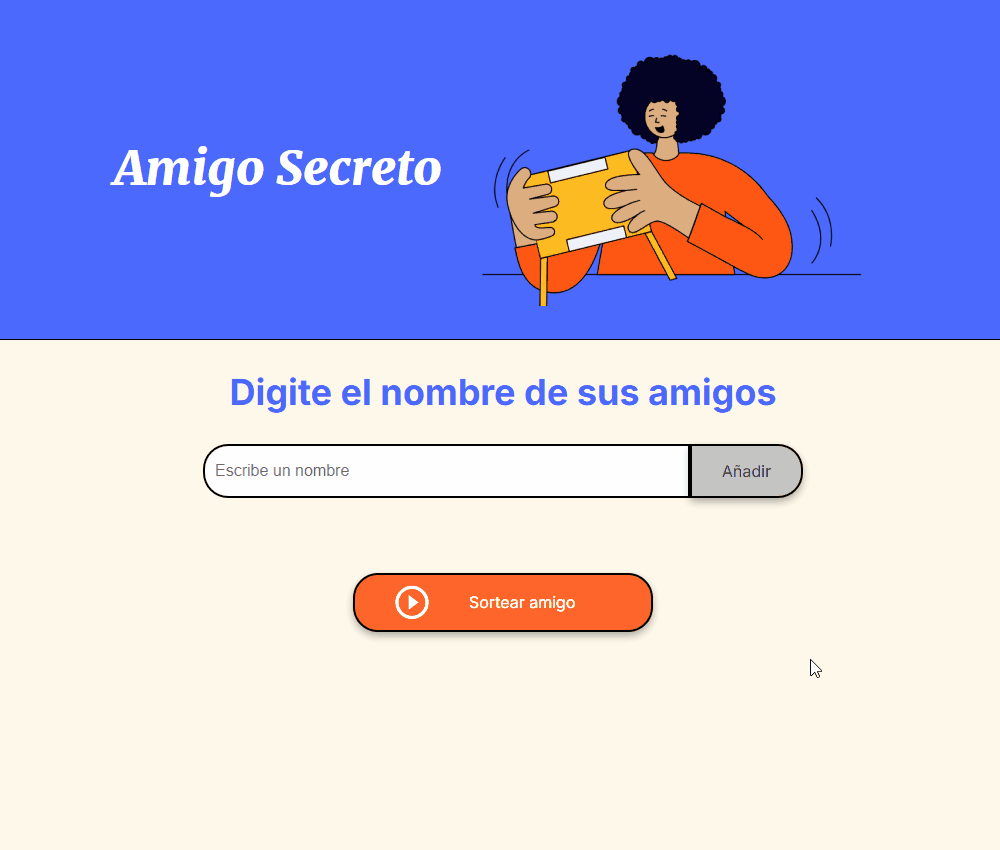

# 🎁 Amigo Secreto

## 📌 Índice
1. [Descripción del Proyecto](#-descripción-del-proyecto)
2. [Características](#-características)
3. [Uso](#-uso)
4. [Estado del Proyecto](#-estado-del-proyecto)
5. [Demostración](#-demostración)
6. [Acceso al Proyecto](#-acceso-al-proyecto)
7. [Tecnologías Utilizadas](#-tecnologías-utilizadas)
8. [Personas Desarrolladoras del Proyecto](#-personas-desarrolladoras-del-proyecto)
9. [Personas Contribuyentes](#-personas-contribuyentes)
10. [Licencia](#-licencia)

## 📖 Descripción del Proyecto
Una aplicación sencilla para realizar un sorteo de amigo secreto. Los usuarios pueden ingresar nombres en una lista y luego seleccionar aleatoriamente uno de ellos.

## 🚀 Características

✅ Agregar amigos a la lista.  
✅ Validar que el campo de entrada no esté vacío.  
✅ Mostrar la lista actualizada en pantalla.  
✅ Sortear un amigo aleatorio y mostrarlo.  

## 📜 Uso

1. Escribe el nombre de un amigo en el campo de entrada.  
2. Haz clic en **"Añadir"** para agregarlo a la lista.  
3. Repite el proceso hasta completar la lista de participantes.  
4. Haz clic en **"Sortear amigo"** para seleccionar aleatoriamente un amigo.  
5. El resultado se mostrará en la pantalla.  

## 🚀 Estado del Proyecto
🟡 En desarrollo - Se planean mejoras como la opción de eliminar nombres y almacenamiento local.

## 🎥 Demostración
Aquí puedes ver cómo funciona la aplicación:

## 🌎 Acceso al Proyecto
🔗 [Ver Proyecto en Vivo](https://galletitadeanis.github.io/AmigoSecreto/)

## 🛠️ Tecnologías Utilizadas
- HTML  
- CSS  
- JavaScript  

## 👨‍💻 Personas Desarrolladoras del Proyecto
- **Paolo Pizarro A.** - [GitHub](https://github.com/GalletitaDeAnis)

## 👨‍💻 Personas Contribuyentes
- [Usuario1](https://github.com/alura-es-cursos)

## 📜 Licencia
Este proyecto está bajo la licencia MIT. Puedes leer más en el archivo [LICENSE](LICENSE).

